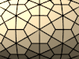

# tessagon: tessellation / tiling with python

Tessellate your favorite 3D surfaces (technically, 2D manifolds) with triangles, hexagons, or a number of other curated tiling types!


(Individual images from the above gif are below.)

## TL;DR

Check out the repository and look in the `demo` directory.

* **Blender**: you'll find a blender file and `tessagon_blender_demo.py` which creates the meshes in the demo. The demo has examples of each tessagon class, and an example that uses tessagon with one of my other projects, [wire_skin](https://github.com/cwant/wire_skin).
* **VTK**: Take a look at `tessagon_vtk_demo.py` for a script that creates all of the current tessagon classes.

This software may also be installed via pip:

`python3 -m pip install tessagon`

or

`pip3 install tessagon`

## How it works

Three things are needed to use tessagon to tessellate the surface of a 2D-manifold (or more accurately, a patch on a 2D-manifold in 3-space):

* Tessagon provides a bunch of classes (subclasses of a class called `Tessagon`) that will tessellate a portion of UV-space with mesh patterns. Parameters provide the details of the bounds in UV-space, the resolution of the tiling, whether the tiling is cyclic, whether a cyclic domain "twists" (think a topological identification space, like a Mobius strip or a Klein bottle), whether it is rotated, etc. These classes are in the `tessagon.types` module.
* The programmer must provide a formula that describes the shape of surface of the 3-dimensional object to create. This function maps two-dimensional space (also known as UV-space) into 3-dimensional space. The tiling happens in the input two dimensional space, and the function maps the tiling onto the surface of the 3-dimensional shape. There are some demo functions in `tessagon.misc.shapes`, such as torii (a.k.a. donuts), spheres, cylinders, etc.
* Finally, an adaptor is chosen to create a mesh in a supported 3D software package. Currently only Blender and VTK are supported:
  * adaptor `BlenderAdaptor` from the module `tessagon.adaptors.blender`
  * adaptor `VtkAdaptor` from the module `tessagon.adaptors.vtk`

The reader should check out the demos, but here is some very basic usage using blender:

```python
from tessagon.types.hex_tessagon import HexTessagon
from tessagon.adaptors.blender_adaptor import BlenderAdaptor

def my_func(u,v):
  return [u, v, u**2 + v**2]
  
options = {
    'function': my_func,
    'u_range': [0.0, 1.0],
    'v_range': [0.0, 1.0],
    'u_num': 8,
    'v_num': 20,
    'u_cyclic': False,
    'v_cyclic': False,
    'adaptor_class' : BlenderAdaptor
  }
tessagon = HexTessagon(**options)

bmesh = tessagon.create_mesh()

# Do something with the bmesh ...
```

## Tessagon classes

Additional tessagon classes can be added by deconstructing how a tessellation fits within a rectangular patch in the plane (check out the ASCII art in each source file in `tessagon.types`). The current `Tessagon` subclasses include:

### Regular tilings

* [SquareTessagon](documentation/square_tessagon.md) (8 color patterns)  
  [](documentation/square_tessagon.md)
* [HexTessagon](documentation/hex_tessagon.md) (2 color patterns)  
  [](documentation/hex_tessagon.md)
* [TriTessagon](documentation/tri_tessagon.md) (3 color patterns)  
  [](documentation/tri_tessagon.md)

### Archimedean tilings

* [OctoTessagon](documentation/octo_tessagon.md)  
  [](documentation/octo_tessagon.md)
* [HexTriTessagon](documentation/hex_tri_tessagon.md)  
  [](documentation/hex_tri_tessagon.md)
* [HexSquareTriTessagon](documentation/hex_square_tri_tessagon.md)  
  [](documentation/hex_square_tri_tessagon.md)
* [DodecaTessagon](documentation/dodeca_tessagon.md)  
  [](documentation/dodeca_tessagon.md)
* [SquareTriTessagon](documentation/square_tri_tessagon.md)  
  [](documentation/square_tri_tessagon.md)
* [SquareTri2Tessagon](documentation/square_tri2_tessagon.md)  
  [](documentation/square_tri2_tessagon.md)
* [DodecaTriTessagon](documentation/dodeca_tri_tessagon.md)  
  [](documentation/dodeca_tri_tessagon.md)

### Laves tilings

* [RhombusTessagon](documentation/rhombus_tessagon.md)  
  [](documentation/rhombus_tessagon.md)
* [FloretTessagon](documentation/floret_tessagon.md) (3 color patterns)  
  [](documentation/floret_tessagon.md)
* [DissectedSquareTessagon](documentation/dissected_square_tessagon.md) (2 color patterns)  
  [](documentation/dissected_square_tessagon.md)
* [DissectedTriangleTessagon](documentation/dissected_triangle_tessagon.md)  
  [](documentation/dissected_triangle_tessagon.md)
* [DissectedHexQuadTessagon](documentation/dissected_hex_quad_tessagon.md)  
  [](documentation/dissected_hex_quad_tessagon.md)
* [DissectedHexTriTessagon](documentation/dissected_hex_tri_tessagon.md)  
  [](documentation/dissected_hex_tri_tessagon.md)
* [PentaTessagon](documentation/penta_tessagon.md)  
  [](documentation/penta_tessagon.md)
* [Penta2Tessagon](documentation/penta2_tessagon.md)  
  [](documentation/penta2_tessagon.md)

### Non-edge-to-edge tilings

* [PythagoreanTessagon](documentation/pythagorean_tessagon.md)  
  [](documentation/pythagorean_tessagon.md)
* [BrickTessagon](documentation/brick_tessagon.md)  
  [](documentation/brick_tessagon.md)
* [WeaveTessagon](documentation/weave_tessagon.md)  
  [](documentation/weave_tessagon.md)
* [HexBigTriTessagon](documentation/hex_big_tri_tessagon.md)  
  [](documentation/hex_big_tri_tessagon.md)
* [ZigZagTessagon](documentation/zig_zag_tessagon.md)  
  [](documentation/zig_zag_tessagon.md)

## Usage and Options

Each tessagon class is initialized with number of keyword options, e.g.:

```
from tessagon.types.dodeca_tessagon import DodecaTessagon
from tessagon.adaptors.vtk_adaptor import VtkAdaptor
tessagon = DodecaTessagon(function=my_func,
                          u_range=[0.0, 1.0],
                          v_range=[0.0, 1.0],
                          u_num=8,
                          v_num=20,
                          u_cyclic=True,
                          v_cyclic=False,
                          adaptor_class=VtkAdaptor)
poly_data = tessagon.create_mesh()
```
The `create_mesh()` method creates a tessellated mesh using your provided function and the tile type corresponding to the tessagon class used. The chosen adaptor dictates the 3D data type the mesh will be (for the `BlenderAdaptor` the output is `BMesh`, for the `VTKAdaptor` the output is `vtkPolyData`).

Here are the options:

* `function`: the function to be used to generate the geometry. This is a function that takes two arguments `u, v` and returns a list of three items `[x, y, z]`
* `u_range`: a list with two items indicating the minimum and maximum values for u (the first argument to the function passed);
* `v_range`: a list with two items indicating the minimum and maximum values for v (the second argument to the function passed);
* `u_num`: the number of tiles to be created in the u-direction;
* `v_num`: the number of tiles to be created in the v-direction;


As you work with the software, keep in mind the difference between a face and a tile. A tile is not a face! A tile is a four-sided region (often a rectangle) that holds one or more faces that form a repeated pattern. A tile often shares faces with neighboring tiles:


  
The source code files for each tessagon class usually contain some ASCII art that illustrates how the pattern of faces is arranged on a tile.

* `corners`: instead of using `u_range` and `v_range`, you can also specify your domain in the uv plain as a quadrilateral by specifying the corners of the region you would like to map. This is a list of four tuples in the following order: bottom-left, bottom-right, top-left, top-right.


* `u_cyclic`: a boolean indicating whether the u-direction is cyclic (wraps around to the beginning again). You're function needs to be periodic in the u-direction for this to look nice. **Note: the default for this is `True`, so set it to `False` if you don't want things to be cyclic**
* `v_cyclic`: a boolean indicating whether the v-direction is cyclic. **Default: `True`**
* `rot_factor`: this is an integer greater than zero that allows you to rotate the tiles in the UV-domain is such a way that the tiling can still be cyclic.
  
  
  
  The `rot_factor` specifies how many tiles you go across before you go up one unit (essentially the reciprocal of the slope of the grid lines. The image depicts a `rot_factor` of three, which generates 45 tiles (the purple interior and the blue boundary squares, each of which is blasted with the tessellation pattern when the function is applied). Here the meaning of `u_num` and `v_num` are interpreted differently: whereas in the non-rotated case, `u_num = 3` and `v_num = 2` would yeild 6 tiles, here we have 45 tiles. Niether U nor V are cyclic in the picture; had they both been cyclic, 60 tiles whould have been generated. The interior tiles form groups of `(rot_factor-1)**2` tiles (here each group is 2 x 2, for 24 total interior tiles), and each boundary shares `rot_factor x 1` tiles with it's neighbors (there are 7 such boundaries, so 21 boundary tiles).
  
  It hurt my brain developing this feature, so don't feel bad if it does't make any sense for you. Play around with it, and keep in mind that the number of tiles generated is somewhere between `u_num * v_num * (rot_factor - 1)**2` and `u_num * v_num * (rot_factor**2 + 1)` (depending on which tiles have neighbors, due to periodicity), so you typically want to set `u_num` and `v_num` to be a lot lower than you would in the non-rotated case.
* `u_twist`: this is used with `v_cyclic` (note that says `v_cyclic` not `u_cyclic`). As the `v` values wrap around, the `u` values reconnect in the opposite direction: the low `u` values connect to the high `u` values, and vice versa. This allows you to make things like Möbius strips and Klein bottles.
* `v_twist`: works with `u_cyclic`, analogous to how `u_twist` works.
* `color_pattern`: some Tessagon types support some curated patterns (applying more than one material/color to the output shape). These are identified by a number (e.g., `color_pattern=2`). The number has no meaning other than as an identifier. Checkout the description of the Tessagon types above to see what color patterns exist. The values of `u_num` and `v_num` may need to be tweaked to make a specific color pattern wrap correctly for cyclic tilings.

## Writing your own tessellation classes

All tesselations are found in the `types` module, so check out the source code there for numerous examples. The source code documentation in `hex_tessagon` is more verbose than the others, which hopefully will aid understanding.

Each tessellation involve two classes: a tile class (a child of `Tile`) and a child of class `Tessagon`. The `Tessagon` subclass is easy (it just declares which tile class with be used), so writing the tile class will take most of your time. 
(The `FloretTessagon` is an exception because the math is more complex.)

There are five methods that you will want to write:

* `__init__`: typically you will want to call the constructor of the super-class. You can declare your tile class to be symmetric in either the u-direction or the v-direction, which will help you greatly if you have structured your vertices and faces well.

* `init_verts`: here you define the structure of your verts in a nested hash. You can use any combination of keys you want as pathways to addressing your vertices. If you declared your class to be u-symmetric, then the words `left` and `right` will have significance in your pathways. Creating a vertex with the word `left` in it's pathway will automagically also create the symmetric `right` vertex, halfing the amount of work you need to do. For v-symmetric tiles, the words `top` and `bottom` have meaning, in an analogous way. If the tile is both u-symmetric and v-symmetric, then each vert created that has a combination of both `left`/`right` and `top`/`bottom` in it's pathway will actually create four symmetric vertices.

* `init_faces`: here you define the structure of your faces in a nested hash. As with vertices, you can reduce your work by exploiting symmetry and using `left`, `right`, `top` and `bottom` when addressing your faces.

* `calculate_verts`: here you define the locations of the vertices in the tiling, via the `add_vert` method. The method takes an array of keys to indicate which vertex is being defined, and a location expressed as a `u_ratio` and a `v_ratio`, both between 0 and 1. A `u_ratio` of 0 is `left` and a `u_ratio` of 1 is right. A `v_ratio` of 0 is `bottom` and a `v_ratio` of 1 is `top`. The symmetry of the tile may cause additional reflected vertices to be defined. Using the boolean keywords `u_boundary`, `v_boundary` and `corner`, you can tell the system whether the vert is shared with neighboring tiles (this reduces the work that needs to be done, and can also keep the model topologically sound and water-tight).

* `calculate_faces`: here you define the faces for the tiling using the previously defined vertices, via the `add_face` method. The method takes an array of face to indicate which face is being defined, and an array of vertex keys that indicate which vertices are in the face. These vertices are either on the current tile, or some of them can being on neighboring tiles (in which case the keys for the neighboring tile are also included). The symmetry of the tile may cause other reflected faces to be defined. Using the boolean keywords `u_boundary`, `v_boundary` and `corner`, you can tell the system whether the face is shared with neighboring tiles.

## wire_skin

Check out my other project `wire_skin` to add some interesting effects to the tessellated manifolds you create:

https://github.com/cwant/wire_skin


## 3D Printing on Shapeways

I primarily use Tessagon to create objects for 3D printing (on [Shapeways](https://www.shapeways.com)). I tag my models with the keyword `tessagon`. If you also use Shapeways to print models made with Tessagon, feel free to use this tag -- I'd be very interested to see what you make!

https://www.shapeways.com/marketplace?q=tessagon

