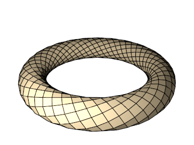
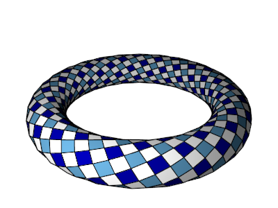
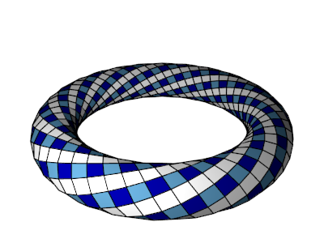
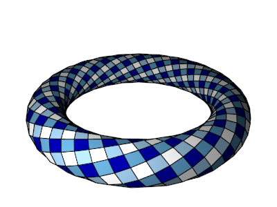

# `SquareTessagon`

Option `color_pattern=1` gives the following pattern:

Option `color_pattern=2` gives the following pattern:

Option `color_pattern=3` gives the following pattern:

Option `color_pattern=4` gives the following pattern:

Option `color_pattern=5` gives the following pattern:

Option `color_pattern=6` gives the following pattern:

Option `color_pattern=7` gives the following pattern:

Option `color_pattern=8` gives the following pattern:

