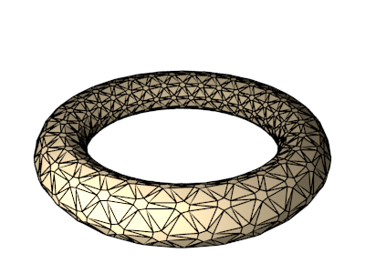

# `BigHexTriTessagon`

## Color patterns

### `color_pattern=1`

## Extra parameters

### `hexagon_ratio` (type: `float`, default: `0.5`, minimum: `0.0`, maximum: `0.7`)
#### `hexagon_ratio=0.25`

#### `hexagon_ratio=0.6`

