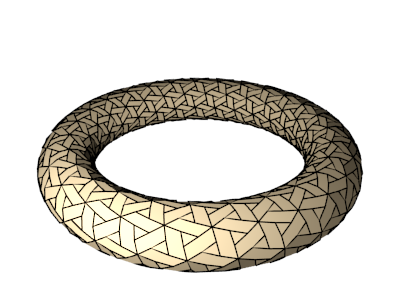
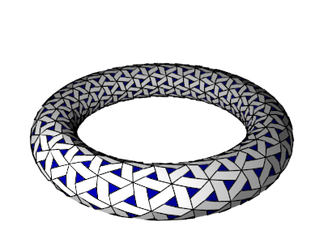
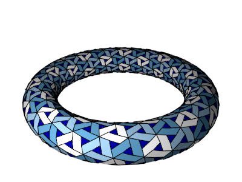
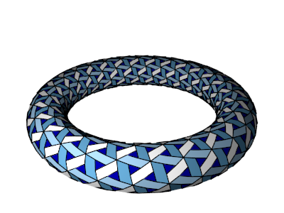
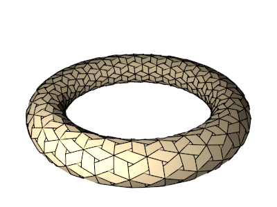
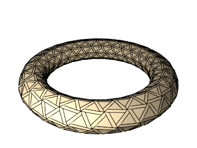

# `HokusaiParallelogramsTessagon`

## Color patterns

### `color_pattern=1`

### `color_pattern=2`

### `color_pattern=3`

## Extra parameters

### `triangle_ratio` (type: `float`, default: `0.36311315497103025`, minimum: `0.0`, maximum: `1.0`)
#### `triangle_ratio=0.18`

#### `triangle_ratio=0.68`

