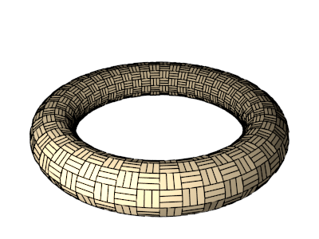
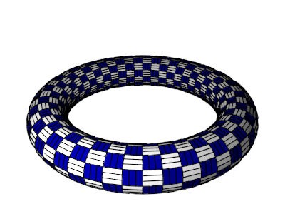
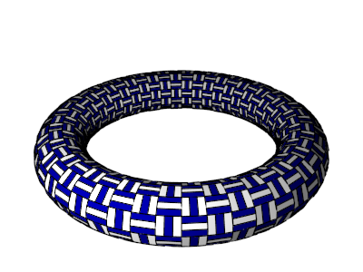
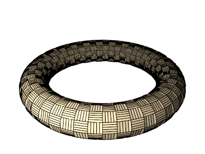

# `SlatsTessagon`

## Color patterns

### `color_pattern=1`

### `color_pattern=2`

## Extra parameters

### `num_slats` (type: `int`, default: `3`, minimum: `2`)
#### `num_slats=2`

#### `num_slats=5`

