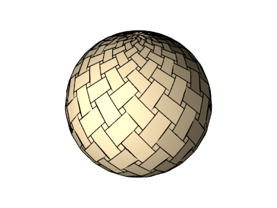
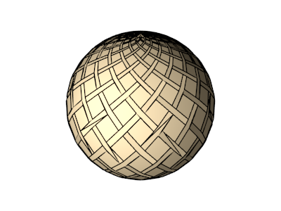

# `WeaveTessagon`

## Color patterns

### `color_pattern=1`

## Extra parameters

### `square_ratio` (type: `float`, default: `0.5`, minimum: `0.0`, maximum: `1.0`)
#### `square_ratio=0.25`

#### `square_ratio=0.75`

